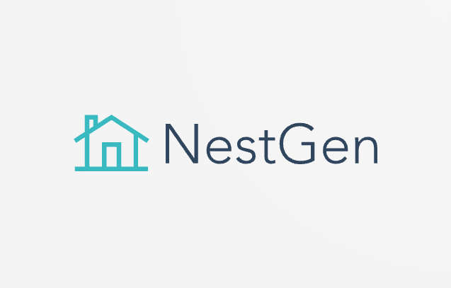
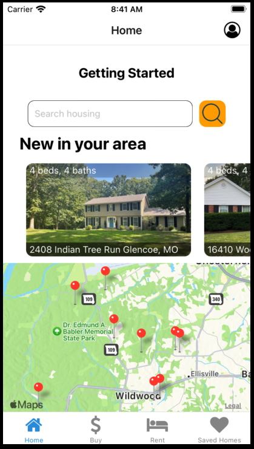

# NestGen

Welcome to NestGen, a cutting-edge React Native real estate application that brings property hunting at your fingertips. The app utilizes React Native for the frontend, Node.js with Express.js for the backend, and harnesses the power of the Realty Mole Property API through RapidAPI.

## About NestGen

NestGen is a digital solution I designed to streamline the process of searching and managing properties. The app leverages the Realty Mole Property API to pull extensive data about property listings, while RapidAPI ensures seamless and efficient management of these API calls. NestGen brings together modern technologies to provide an intuitive, user-friendly interface that simplifies real estate transactions.

## Features

- Real-time property listings
- Advanced search filters
- Property comparison
- Favourite property marking
- User authentication and management

## Getting Started

### Prerequisites

- Node.js (v14.0.0 or later)

### Installation

Follow the steps below to set up the environment:

1. Clone the repository: `git clone https://github.com/<Your Github Username>/NestGen.git`
2. Navigate into the directory: `cd NestGen`
3. Install the dependencies: `npm install`

## Technologies Used

### Frontend

1. **React Native**: NestGen is built using React Native, a popular framework for building native mobile apps using JavaScript and React.
2. **Expo Go**: The Expo Go client allows me to open the React Native project on a device without needing to set up Xcode or Android Studio.

### Backend

1. **Node.js and Express**: Node.js and Express.js are used to create a robust backend for the application.
2. **MongoDB**: The app uses MongoDB as its primary database. Mongoose is used as an ODM (Object Document Mapper) for MongoDB to provide a straightforward, schema-based solution to model the application data.
3. **MongoDB Atlas**: As a cloud database service, MongoDB Atlas provides scalability, high availability, and compliance with the most demanding data security and privacy standards.
4. **Bcrypt**: Bcrypt is used to hash and securely store passwords.

### API

**Realty Mole Property API**: This API is used to fetch real-time property listings. The data from the API is comprehensive, allowing users to have detailed insights into the properties.

### Geolocation

**Expo Geolocation**: The app utilizes Expo's Geolocation API to provide personalized property recommendations based on the user's location.

## Contribution

Contributions are what make the open-source community an amazing place to learn, inspire, and create. Any contributions to NestGen are **greatly appreciated**. Here's how you can contribute:

1. Fork the Project
2. Create your Feature Branch (`git checkout -b feature/AmazingFeature`)
3. Commit your Changes (`git commit -m 'Add some AmazingFeature'`)
4. Push to the Branch (`git push origin feature/AmazingFeature`)
5. Open a Pull Request

## Contact

For any inquiries or collaborations, please feel free to reach out.

Ali Siddiqui - alisiddiquia22@yahoo.com

## Acknowledgements

- [RapidAPI](https://rapidapi.com/)
- [Realty Mole Property API](https://www.realtymole.com/)

Enjoy house hunting with NestGen!
